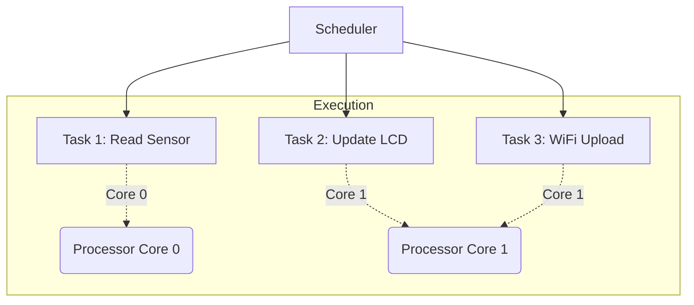

# Pertemuan 10: ⏱️ Real-Time Operating System (RTOS) pada ESP32

> **Mikrokontroler | Teknik Informatika**

---

## 🎯 Tujuan Pembelajaran

Setelah mengikuti pertemuan ini, mahasiswa diharapkan mampu:

1. Memahami perbedaan antara sistem *Super-Loop* dan *Multitasking*
2. Menjelaskan konsep dasar FreeRTOS (Task, Priority, Scheduler)
3. Mengimplementasikan *Multitasking* sederhana pada dual-core ESP32
4. Memahami mekanisme komunikasi antar task menggunakan Queue (opsional/dasar)

---

### 🔄 FreeRTOS Task Management



---

## 📚 Materi Pokok

### 1. Apa itu RTOS?

#### A. Definisi
RTOS (*Real-Time Operating System*) adalah sistem operasi yang dirancang untuk menjalankan tugas-tugas dengan ketepatan waktu yang sangat tinggi. Pada mikrokontroler seperti ESP32, RTOS yang paling umum digunakan adalah **FreeRTOS**.

#### B. Super-Loop vs Multitasking
- **Super-Loop (Standard Arduino):** Program berjalan dalam satu loop besar (`void loop()`). Jika satu fungsi memakan waktu lama (misal: `delay()`), fungsi lain harus menunggu.
- **Multitasking (RTOS):** Program dipecah menjadi beberapa **Task** yang berjalan secara independen. Scheduler mengatur kapan tiap task mendapat giliran menggunakan CPU.

---

### 2. Dasar-dasar FreeRTOS

#### A. Task
Task adalah blok kode (seperti fungsi) yang berjalan secara kompetitif. Tiap task memiliki stack-nya sendiri.

#### B. Priority
Tiap task memiliki prioritas (0 hingga N). Task dengan prioritas lebih tinggi akan didahulukan oleh Scheduler.

#### C. Tick Rate
Waktu resolusi scheduler, biasanya 1ms (1000Hz).

---

### 3. Implementasi pada ESP32 (Dual Core)

ESP32 memiliki dua inti prosesor (Core 0 dan Core 1). FreeRTOS pada ESP32 memungkinkan kita menempatkan task pada core tertentu menggunakan `xTaskCreatePinnedToCore()`.

#### A. Contoh Kode: Menjalankan Dua Loop Bersamaan

```cpp
void Task1(void *pvParameters) {
  for (;;) {
    Serial.print("Task 1 berjalan di Core: ");
    Serial.println(xPortGetCoreID());
    delay(1000);
  }
}

void Task2(void *pvParameters) {
  for (;;) {
    Serial.print("Task 2 berjalan di Core: ");
    Serial.println(xPortGetCoreID());
    delay(1500);
  }
}

void setup() {
  Serial.begin(115200);

  // Membuat Task 1 pada Core 0
  xTaskCreatePinnedToCore(
    Task1,    // Nama fungsi task
    "Task1",  // Nama task
    10000,    // Stack size
    NULL,     // Parameter
    1,        // Prioritas
    NULL,     // Task handle
    0         // Core ID (0)
  );

  // Membuat Task 2 pada Core 1
  xTaskCreatePinnedToCore(
    Task2,
    "Task2",
    10000,
    NULL,
    1,
    NULL,
    1         // Core ID (1)
  );
}

void loop() {
  // Loop utama bisa dikosongkan atau digunakan untuk task lain
}
```

---

### 4. Sinkronisasi: vTaskDelay vs delay()

Dalam FreeRTOS, sangat disarankan menggunakan `vTaskDelay()` atau fungsi `delay()` yang sudah dibungkus oleh RTOS agar Scheduler bisa memberikan waktu CPU ke task lain saat suatu task sedang menunggu.

---

## 🎥 Video Penjelasan

### Tutorial FreeRTOS pada ESP32

<iframe width="725" height="453" src="https://www.youtube.com/embed/videoseries?list=PLaC2GD6EmthVB7f7ZJjgGAU9K3ylxzDMJ" frameborder="0" allowfullscreen></iframe>

---

## 📚 Sumber Belajar

- 📁 [Proyek GitHub - Implementasi FreeRTOS pada ESP32](https://github.com/Muhammad-Ikhwan-Fathulloh/ESP32-dengan-Free-RTOS)
- 🌐 [Official FreeRTOS Documentation](https://www.freertos.org/Documentation/RTOS_book.html)
- 📄 [Espressif - FreeRTOS $(\text{ESP-IDF})$ Guide](https://docs.espressif.com/projects/esp-idf/en/latest/esp32/api-reference/system/freertos.html)
