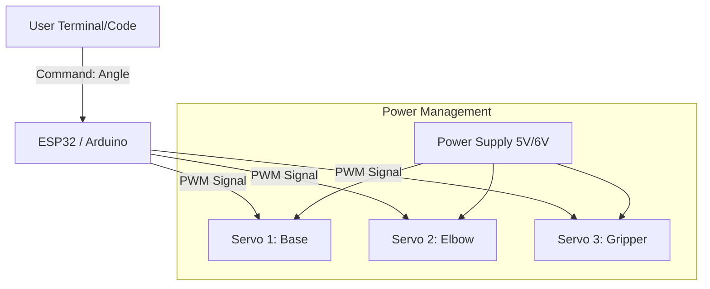
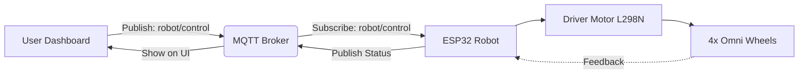

# Pertemuan 12: 🤖 Robotika: Arm Robotik

> **Mikrokontroler | Teknik Informatika**

---

## 🎯 Tujuan Pembelajaran

Setelah mengikuti pertemuan ini, mahasiswa diharapkan mampu:

1. Mengenal jenis-jenis motor servo untuk aplikasi robotika
2. Memahami konsep Derajat Kebebasan (*Degree of Freedom* / DoF) pada robot
3. Mengontrol pergerakan lengan robot melalui mikrokontroler
4. Menjalankan urutan pergerakan (*motion sequence*) secara otomatis

---

### 🔄 Alur Kontrol Arm Robotik



---

## 📚 Materi Pokok

### 1. Dasar Robot Arm

#### A. Apa itu Arm Robotik?
Arm robotik adalah jenis lengan mekanis yang biasanya dapat diprogram, dengan fungsi yang mirip dengan lengan manusia. Lengan ini dapat menjadi mekanisme utuh atau bisa menjadi bagian dari robot yang lebih kompleks.

#### B. Derajat Kebebasan (DoF)
*Degree of Freedom* (DoF) menentukan fleksibilitas gerakan robot.
- **3-DoF:** Biasanya memiliki sendi bahu, siku, dan pergelangan dasar.
- **6-DoF:** Standar industri yang memungkinkan robot mencapai posisi dan orientasi apapun di ruang kerja.

---

### 2. Komponen Utama

1. **Mikrokontroler:** Arduino atau ESP32 sebagai pemberi sinyal PWM.
2. **Servo Motor:** Aktuator utama (Contoh: MG90S, MG996R).
3. **Power Supply:** Diperlukan daya eksternal (5V-6V) karena servo mengonsumsi arus yang besar saat bergerak.
4. **Struktur Mekanik:** Rangka lengan yang terbuat dari akrilik, aluminium, atau hasil 3D print.

---

### 3. Kontrol Multi-Servo

Untuk mengontrol banyak servo sekaligus, kita bisa menggunakan library standar `Servo.h` (Arduino) atau `ESP32Servo.h` (ESP32).

#### Contoh Kode: Gerakan Dasar Lengan Robot

```cpp
#include <Servo.h>

Servo baseServo;
Servo elbowServo;
Servo gripperServo;

void setup() {
  baseServo.attach(9);     // Pin Pin 9
  elbowServo.attach(10);    // Pin 10
  gripperServo.attach(11);  // Pin 11
  
  // Posisi Home
  baseServo.write(90);
  elbowServo.write(90);
  gripperServo.write(0);
}

void loop() {
  // Ambil Barang
  moveSlowly(baseServo, 90, 45); // Gerak ke kiri
  moveSlowly(elbowServo, 90, 130); // Turun
  moveSlowly(gripperServo, 0, 90); // Jepit
  delay(1000);
  
  // Angkat Barang
  moveSlowly(elbowServo, 130, 90); // Naik
  moveSlowly(baseServo, 45, 135); // Putar ke kanan
  delay(1000);
}

// Fungsi agar gerakan tidak terlalu menghentak
void moveSlowly(Servo &s, int from, int to) {
  if (from < to) {
    for (int i = from; i <= to; i++) {
      s.write(i);
      delay(15);
    }
  } else {
    for (int i = from; i >= to; i--) {
      s.write(i);
      delay(15);
    }
  }
}
```

---

### 4. Konsep Kinematika (Pengenalan)

1. **Forward Kinematics:** Menghitung posisi ujung lengan (*End Effector*) berdasarkan sudut-sudut sendi.
2. **Inverse Kinematics:** Menghitung berapa sudut masing-masing sendi yang diperlukan agar ujung lengan mencapai koordinat (X, Y, Z) tertentu.

---

## 📚 Sumber Belajar

- 📁 [Repositori GitHub - Arm Robotik](https://github.com/Muhammad-Ikhwan-Fathulloh/Arm-Robotik)
- 📄 [How to build a Simple Arduino Robot Arm](https://howtomechatronics.com/tutorials/arduino/diy-arduino-robot-arm-project/)
- 🎥 [Tutorial Robot Arm - YouTube](https://www.youtube.com/results?search_query=arduino+robot+arm+tutorial)

# Pertemuan 12 lanjutan: 🤖 Robotika: Mobile Robot

> **Mikrokontroler | Teknik Informatika**

---

## 🎯 Tujuan Pembelajaran

Setelah mengikuti pertemuan ini, mahasiswa diharapkan mampu:

1. Mengenal konsep robot mobile dengan roda omnidireksional (*Omniwheel*)
2. Memahami arsitektur kontrol robot menggunakan protokol MQTT
3. Merancang sistem navigasi sederhana (maju, mundur, geser, rotasi)
4. Mengintegrasikan ESP32 dengan driver motor L298N untuk penggerak robot

---

### 🔄 Alur Kontrol KoKuBot



---

## 📚 Materi Pokok

### 1. Pengenalan KoKuBot (Omniwheel Robot)

#### A. Apa itu Omniwheel?
Roda omni (*Omniwheel*) memiliki roda-roda kecil di sekeliling diameternya yang tegak lurus dengan arah putaran roda utama. Hal ini memungkinkan robot bergerak ke segala arah (maju, mundur, samping, diagonal) tanpa harus memutar badan robot terlebih dahulu.

#### B. Konfigurasi 4-Omniwheel
Dengan 4 roda yang dipasang bersilangan, robot dapat melakukan pergerakan:
- **Lateral:** Geser ke kanan atau ke kiri.
- **Diagonal:** Gabungan gerakan linear.
- **Rotation:** Berputar di tempat (pivot).

---

### 2. Arsitektur Kontrol via MQTT

Mobile robot ini dikendalikan secara nirkabel melalui broker MQTT.

- **Broker:** Sebagai perantara antara aplikasi pengendali (Dashboard) dan Robot.
- **Topic `robot/control`:** Digunakan untuk mengirim perintah (`forward`, `backward`, `left`, `right`, `rotate_left`, `stop`).
- **Topic `robot/status`:** Digunakan robot untuk melaporkan status (misal: tegangan baterai atau jarak halangan).

---

### 3. Koneksi Hardware

| Komponen             | Fungsi                                             |
| -------------------- | -------------------------------------------------- |
| **ESP32**            | Otak pemroses perintah dan koneksi WiFi/MQTT       |
| **2x L298N**         | Driver motor (masing-masing mengontrol 2 motor DC) |
| **4x Motor DC**      | Penggerak roda omni                                |
| **Battery 7.4V-12V** | Sumber daya motor dan mikrokontroler               |

---

### 4. Contoh Logika Kontrol (Pseudocode)

```cpp
void moveRobot(String command) {
  if (command == "forward") {
    // Gerakkan semua motor ke depan
  } else if (command == "right") {
    // Kombinasi arah motor untuk geser kanan
  } else if (command == "turn_left") {
    // Putar motor kiri mundur, motor kanan maju
  } else if (command == "stop") {
    // Matikan semua PWM motor
  }
}
```

---

## 📚 Repositori & Proyek

### KoKuBot (Mobile Robot)
Berisi kode sumber untuk berbagai fitur, diagram koneksi hardware, dan dokumentasi lengkap.

- 📁 [Repositori GitHub](https://github.com/Muhammad-Ikhwan-Fathulloh/KoKuBot)
- 🌐 [Halaman Proyek KoKuBot](https://ikhwanfathulloh.netlify.app/kokubot)

---

## 🎥 Video Penjelasan

*Cari demo robot di saluran YouTube utama atau repositori terkait untuk melihat implementasi nyatanya.*

---

## 📚 Sumber Belajar

- 📄 [Omnidirectional Mobile Robot Theory](https://modernrobotics.northwestern.edu/nu-gm-book-resource/13-2-omnidirectional-wheeled-mobile-robots/)
- 📄 [MQTT Explorer for Debugging](http://mqtt-explorer.com/)
