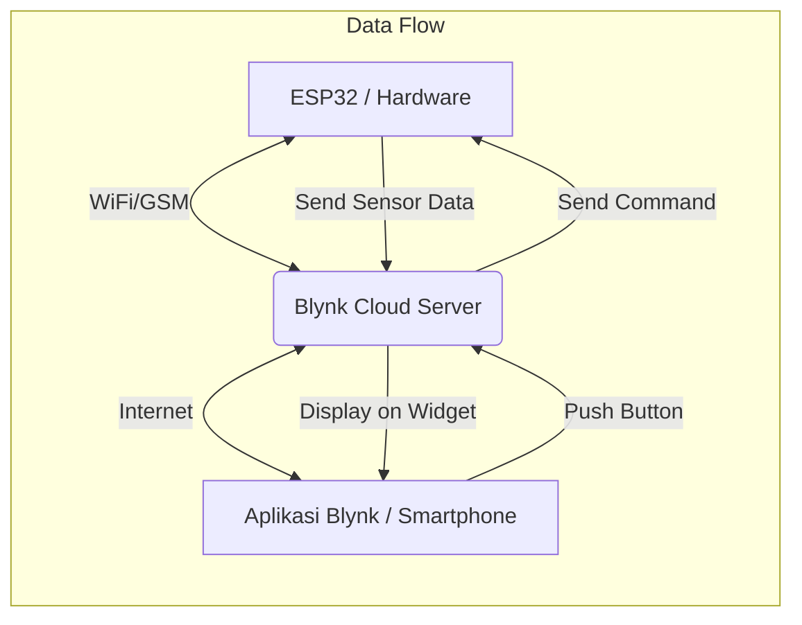

# Pertemuan 6: ☁️ Platform Internet of Things: Blynk

> **Mikrokontroler | Teknik Informatika**

---

## 🎯 Tujuan Pembelajaran

Setelah mengikuti pertemuan ini, mahasiswa diharapkan mampu:

1. Mengenal platform Blynk sebagai dashboard IoT
2. Memahami konsep komunikasi antara ESP32 dan aplikasi Blynk
3. Mengonfigurasi Virtual Pins untuk kontrol dan monitoring
4. Membuat antarmuka kontrol (button) dan monitoring (gauge/display) pada smartphone

---

### 🔄 Alur Kerja Blynk



---

## 📚 Materi Pokok

### 1. Pengenalan Blynk IoT

#### A. Apa itu Blynk?
Blynk adalah platform *low-code* untuk Internet of Things (IoT) yang memungkinkan kita membuat antarmuka (dashboard) pada smartphone atau web untuk mengendalikan dan memantau perangkat keras (Arduino, ESP32, Raspberry Pi) dengan cepat.

#### B. Komponen Utama Blynk
1. **Blynk App:** Aplikasi mobile untuk merancang antarmuka (Widgets).
2. **Blynk Cloud:** Server yang menghubungkan aplikasi mobile dengan perangkat keras.
3. **Blynk Libraries:** Library pada Arduino IDE yang menangani komunikasi data.

---

### 2. Konsep Virtual Pins

Virtual Pins merupakan fitur unik Blynk yang digunakan untuk mengirim data antara perangkat keras dan aplikasi tanpa terikat pada pin fisik (GPIO).

| Fitur             | Deskripsi                                                          |
| ----------------- | ------------------------------------------------------------------ |
| **V0 - V255**     | Rentang Virtual Pins yang tersedia                                 |
| **Tipe Data**     | String, Integer, Float, bahkan Array                               |
| **Fleksibilitas** | Memungkinkan pengolahan logika di kode sebelum dikirim ke hardware |

---

### 3. Persiapan dan Instalasi

#### A. Library Blynk
1. Buka Arduino IDE.
2. Klik **Sketch → Include Library → Manage Libraries**.
3. Cari **"Blynk"** oleh Volodymyr Shymanskyy.
4. Klik **Install**.

#### B. Mendapatkan Auth Token
1. Buat akun di **Blynk.cloud** atau Aplikasi Blynk IoT.
2. Buat **New Template**.
3. Tambahkan **Datastreams** (Virtual Pin).
4. Salin **Template ID**, **Template Name**, dan **Auth Token**.

---

### 4. Contoh Kode: Kontrol LED & Monitoring Sensor

```cpp
#define BLYNK_TEMPLATE_ID "TMPLxxxxxx"
#define BLYNK_TEMPLATE_NAME "DeviceName"
#define BLYNK_AUTH_TOKEN "YourAuthToken"

#include <WiFi.h>
#include <WiFiClient.h>
#include <BlynkSimpleEsp32.h>

char auth[] = BLYNK_AUTH_TOKEN;
char ssid[] = "NamaWiFi";
char pass[] = "PasswordWiFi";

const int ledPin = 2;

// Fungsi yang dijalankan saat tombol di aplikasi ditekan (Virtual Pin V1)
BLYNK_WRITE(V1) {
  int value = param.asInt(); // Ambil nilai dari tombol (0 atau 1)
  digitalWrite(ledPin, value);
}

void setup() {
  Serial.begin(115200);
  pinMode(ledPin, OUTPUT);
  
  // Memulai koneksi Blynk
  Blynk.begin(auth, ssid, pass);
}

void loop() {
  Blynk.run(); // Menjalankan proses latar belakang Blynk
}
```

---

## 🎥 Video Penjelasan

### Integrasi ESP32 dengan Blynk

<iframe width="725" height="453" src="https://www.youtube.com/embed/pI9clelWYkI" frameborder="0" allowfullscreen></iframe>

---

## 📚 Sumber Belajar

- 🌐 [Blynk Documentation](https://docs.blynk.io/)
- 📄 [Blynk Examples Browser](https://examples.blynk.cc/)
